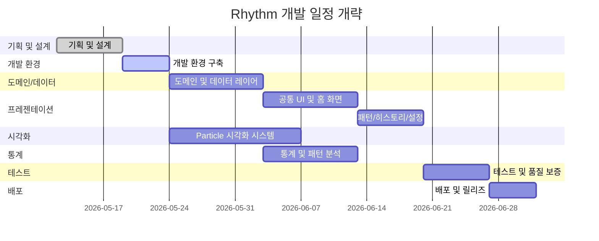

# Rhythm — Work Breakdown Structure (WBS)

> `.planning/00-vision.md` 및 `.planning/01-requirements.md`를 기반으로 작성

---

## WBS 테이블

| WBS | 작업명 (Lv.2) | 세부 작업 (Lv.3) | 산출물 |
|:---:|---|---|---|
| **1** | **기획 및 설계** | | |
| 1.1 | 프로젝트 기획 | • 비전 및 문제 정의 문서화 • 핵심 시나리오 3개 및 MoSCoW 작성 • AUTHORING 메타데이터 및 라이선스 정의 | `00-vision.md` `01-requirements.md` |
| 1.2 | 시스템 설계 | • Clean Architecture 레이어 구조 설계 • Isar DB 스키마 설계 • UI/UX 와이어프레임 및 화면 흐름도 • Particle 시각화 컨셉 및 색상-데이터 매핑 규칙 정의 | 설계 문서 |
| 1.3 | 개발 문서화 | • WBS 작성 • 일정 및 리스크 문서화 • 설계 결정 문서(ADR) 초안 작성 | `02-wbs.md` `04-schedule.md` |
| **2** | **개발 환경 구축** | | |
| 2.1 | 프로젝트 초기화 | • Flutter 프로젝트 생성 및 폰더 구조 설정 • 필수 패키지 의존성 추가 • `.gitignore`, `analysis_options.yaml` 설정 | 프로젝트 템플릿 |
| 2.2 | 아키텍처 기반 구축 | • Clean Architecture 폰더 구조 구현 • Riverpod Provider 구조 및 DI 설정 • 공통 유틸리티 및 확장 함수 정의 | `lib/` 초기 구조 |
| **3** | **도메인 및 데이터 레이어 개발** | | |
| 3.1 | 도메인 레이어 | • 핵심 Entity 정의 • Repository 인터페이스 정의 • UseCase 구현 | `domain/` 레이어 |
| 3.2 | 데이터 레이어 | • Isar DB 초기화 및 마이그레이션 • Isar Collection 모델 정의 • Repository 구현체 작성 • 예외 처리 및 트랜잭션 관리 | `data/` 레이어 |
| **4** | **프레젠테이션 레이어 개발** | | |
| 4.1 | 공통 UI 인프라 | • 앱 테마 및 디자인 시스템 • 공통 위젯 라이브러리 • 앱 네비게이션 구조 | 테마 / 공통 위젯 |
| 4.2 | 홈 화면 (일일 입력) | • 에너지 레벨 슬라이더 • 감정 키워드 다중 선택 • 활동 태그 다중 선택 • 짧은 메모 입력 필드 • 저장 액션 및 상태 피드백 • Particle Canvas 실시간 연동 | 홈 화면 |
| 4.3 | 패턴 화면 (통계/분석) | • 주간 리듬 뷰 • 월간 리듬 뷰 • 통계 카드 UI • Multi-Layer 블렌딩 뷰 • "나의 관찰 노트" UI | 패턴 화면 |
| 4.4 | 히스토리 화면 | • 캘린더 기반 기록 탐색 • 특정 날짜 상세 조회 및 수정/삭제 • 무한 스크롤 타임라인 뷰 | 히스토리 화면 |
| 4.5 | 설정 화면 | • 일일 리마인드 알림 시간 설정 • 데이터 내보내기(JSON/CSV) • 테마/다크모드 토글 | 설정 화면 |
| **5** | **Particle 시각화 시스템** | | |
| 5.1 | Particle 엔진 | • CustomPainter 기반 캔버스 • Particle 클래스 설계 • 프레임 루프(60fps 최적화) • 터치/제스처 인터랙션 | Particle 엔진 |
| 5.2 | 데이터-시각화 매핑 | • 감정 키워드 ↔ 색상/형태 매핑 • 에너지 레벨 ↔ 파동 강도 매핑 • 활동 태그 ↔ 궤적/클러스터 매핑 • 시간 흐름에 따른 상태 변화 로직 | 매핑 규칙 |
| 5.3 | Multi-Layer 블렌딩 | • 개별 레이어 렌더링 • BlendMode 기반 레이어 합성 • 레이어 투명도/가중치 조절 • 레이어별 독립 제어 및 최적화 | 블렌딩 시스템 |
| **6** | **통계 및 패턴 분석** | | |
| 6.1 | 기초 통계 엔진 | • 에너지 평균/표준편차/최빈값 • 감정 키워드 빈도 및 분포 • 활동 태그별 집계 | 통계 로직 |
| 6.2 | 상관관계 분석 | • 활동-감정 Pearson 상관계수 • 요일-에너지 상관관계 • 감정-에너지 공변 분석 | 상관관계 로직 |
| 6.3 | 패턴 검출 및 힌트 | • 주간 반복 패턴 탐지 • 감정/에너지 급변 시점 탐지 • 사용자 친화적 힌트 문구 생성 • 최소 데이터(2주) 기준 가드 | 패턴 힌트 로직 |
| **7** | **테스트 및 품질 보증** | | |
| 7.1 | 단위 테스트 | • Entity 및 Value Object 테스트 • UseCase 비즈니스 로직 테스트 • 통계 분석 알고리즘 테스트 | 테스트 코드 |
| 7.2 | 위젯 테스트 | • 홈 화면 입력 흐름 테스트 • 패턴 화면 통계 카드 렌더링 테스트 • Particle Canvas 기본 렌더링 테스트 | 테스트 코드 |
| 7.3 | 통합 테스트 | • 저장→조회→통계 E2E 흐름 테스트 • DB 마이그레이션 호환성 테스트 | 테스트 코드 |
| 7.4 | 성능 및 안정성 | • 렌더링 16ms 이하(60fps) 벤치마크 • Isar 복합 쿼리 100ms 이하 측정 • 오프라인 CRUD 동작 검증 • 메모리 누수 및 리소스 정리 검증 | 성능 리포트 |
| **8** | **배포 및 릴리즈** | | |
| 8.1 | 빌드 및 서명 | • Android APK/AAB 빌드 및 서명 • iOS Archive 빌드 및 서명 • 릴리즈 모드 최적화 | 빌드 산출물 |
| 8.2 | 스토어 배포 준비 | • 앱 아이콘, 스플래시, 스크린샷 • 스토어 메타데이터 작성 • 프라이버시 정책 및 라이선스 고지 | 스토어 에셋 |
| 8.3 | 문서 및 발표 | • 중간 발표 자료 작성 • 최종 발표 자료 작성 • 사용자 가이드 및 개발자 문서 완성 | `docs/presentation/` |

---

## Gantt Chart (개략)

> **참고:** 상세 일정(주차별 목표, 산출물, 검증 방법)은 `.planning/04-schedule.md`에서 다룹니다.

---

*문서 버전: 2.0*  
*작성일: 2026-05-12*
