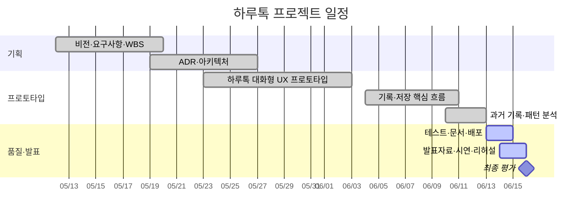

# 하루톡 Work Breakdown Structure

## 작업 분해 구조

| WBS | 작업 | 세부 작업 | 상태 | 산출물 |
|---|---|---|---|---|
| 1.1 | 비전·문제 정의 | 긴 일기 부담, 기록 활용 문제, 핵심 가치 | 완료 | `00-vision.md` |
| 1.2 | 요구사항·범위 | 사용자 시나리오, MoSCoW, 완료 기준 | 완료 | `01-requirements.md` |
| 1.3 | 일정·위험 | WBS, 일정, 위험 대응 | 완료 | `02-wbs.md`, `03-risk.md`, `04-schedule.md` |
| 2.1 | 기술 결정 | Flutter, 간소화 구조, 로컬 저장 ADR | 완료 | ADR-0001~0003 |
| 2.2 | 앱 구조 | Screen, Controller, Domain, Repository 분리 | 완료 | `docs/architecture.md` |
| 3.1 | 기록 흐름 | 기분, 키워드, 만족도, 한 줄 생성 | 완료 | `record_screen.dart` |
| 3.2 | 결과 제어 | 다시 생성, 수정, 저장, 삭제 | 완료 | `summary_editor.dart`, Controller |
| 3.3 | 로컬 저장 | 기록·사용자 키워드 저장과 복구 | 완료 | SharedPreferences Repository |
| 3.4 | 과거 기록 | 날짜 선택과 하루 한 개 기록 | 완료 | 감정잔디, Controller |
| 4.1 | 기록 조회 | 한줄 목록과 상세 | 완료 | `diary_screen.dart` |
| 4.2 | 감정잔디 | 월 이동, 날짜별 기분, 빈 날짜 기록 | 완료 | `mood_grass_screen.dart` |
| 4.3 | 통계 | 주간·월간·연간 집계 | 완료 | `my_screen.dart` |
| 4.4 | 생활 패턴 | 키워드별 만족도와 대표 기분 분석 | 완료 | `pattern_analysis.dart` |
| 5.1 | UI 디자인 | Material 3, 다크 모드, 모바일 최대 폭 | 완료 | Theme, 공통 UI |
| 5.2 | 토리 에셋 | 상태별 투명 이미지 분리·연결 | 완료 | `assets/tori/` |
| 6.1 | 단위 테스트 | Controller, 저장, 패턴 분석 | 완료 | `test/` |
| 6.2 | 통합 테스트 | 기록 흐름, 날짜·통계 화면 | 완료 | `test/` |
| 6.3 | 빌드·배포 | Web Release, GitHub Pages, URL 확인 | 진행 | `docs/deploy.md` |
| 7.1 | 문서화 | README, AGENTS, setup/deploy/testing | 완료 | 저장소 문서 |
| 7.2 | 최종 발표 | 5분 자료, 4분30초 대본, Q&A | 진행 | 발표자료·대본 |
| 7.3 | 시연 | 30초 사용자 시나리오 영상 | 예정 | MP4 |

## 진행 요약

- 전체 WBS 항목: 21개
- 완료: 18개
- 진행: 2개
- 예정: 1개
- 현재 진척률: 약 86%

## 일정 Gantt

## 개발 전략

하루톡은 긴 기록의 부담을 줄이는 사용자 경험을 먼저 설계한 뒤, 질문형 기록 흐름과 로컬 저장을 구현했다. 이후 감정잔디와 생활 패턴 분석을 연결하고, 최종 단계에서는 기능 수를 늘리기보다 테스트·문서화·배포 안정성을 높이는 데 집중했다.
