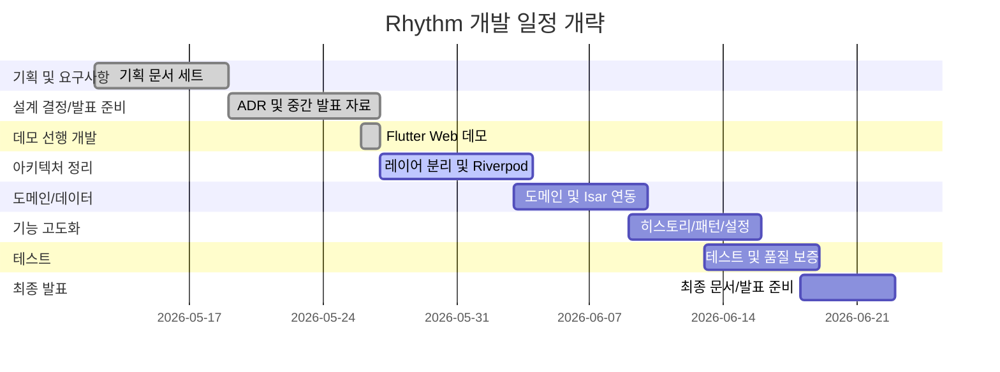

# Rhythm — Work Breakdown Structure (WBS)

> 현재 프로젝트 진행 흐름을 반영한 작업 분해 구조.  
> 중간 발표 준비를 위해 일부 구현 순서를 조정했으며, Flutter Web 데모를 먼저 만든 뒤 아키텍처 분리와 Isar 연동을 진행한다.

---

## WBS 테이블

| WBS | 작업명 (Lv.2) | 세부 작업 (Lv.3) | 산출물 |
|:---:|---|---|---|
| **1** | **기획 및 요구사항** | | |
| 1.1 | 프로젝트 기획 | • 비전 및 문제 정의 문서화 • 핵심 사용자 시나리오 3개 작성 • MoSCoW 요구사항 분류 | `00-vision.md` `01-requirements.md` |
| 1.2 | 일정 및 위험 관리 | • WBS 작성 • 10~15주차 일정 정리 • 위험 식별 및 대응 방안 작성 | `02-wbs.md` `03-risk.md` `04-schedule.md` |
| 1.3 | 작성자/가산점 문서 | • AUTHORING 문서 작성 • BONUS 가산점 트래킹 문서 작성 | `AUTHORING...md` `BONUS.md` |
| **2** | **설계 결정 및 발표 준비** | | |
| 2.1 | ADR 작성 | • Flutter 선택 이유 • Layered Architecture 선택 이유 • Isar 기반 로컬 우선 저장 선택 이유 | `ADR-0001~0003` |
| 2.2 | 중간 발표 자료 | • 중간 발표 Marp 슬라이드 작성 • 발표자료 HTML 변환 • Q&A 대비용 기술 선택 근거 정리 | `docs/presentation/interim.md` `presentation.html` |
| 2.3 | GitHub Pages 공개 | • WBS/Gantt 페이지 루트 배치 • 발표자료 URL 공개 • Flutter Web 데모 URL 공개 | `wbs-gantt.html` `index.html` |
| **3** | **중간 발표용 Flutter Web 데모 선행 개발** | | |
| 3.1 | Flutter 프로젝트 초기화 | • Flutter 프로젝트 생성 • Web/Windows 플랫폼 구성 • 기본 테스트 및 분석 환경 구성 | `pubspec.yaml` `lib/main.dart` `test/widget_test.dart` |
| 3.2 | 일일 입력 데모 | • 에너지 레벨 입력 • 감정 키워드 선택 • 활동 태그 선택 • 짧은 메모 저장 | 오늘 탭 |
| 3.3 | 시각화 데모 | • CustomPainter 기반 Particle Canvas • 감정/에너지 기반 색상과 파동 표현 • 더미 데이터 기반 즉시 시연 | Particle Canvas |
| 3.4 | 히스토리/패턴 데모 | • 저장된 기록 목록 표시 • 평균 에너지 카드 • 자주 나온 감정/활동 카드 • 최근 흐름 그래프 | 히스토리 탭 패턴 탭 |
| **4** | **아키텍처 정리 및 리팩토링** | | |
| 4.1 | 레이어 구조 분리 | • 현재 단일 파일 데모를 Presentation/Application/Domain/Data로 분리 • 화면, Painter, Entity, Repository 책임 분리 | `lib/` 레이어 구조 |
| 4.2 | 상태 관리 정리 | • Riverpod 도입 • 입력 상태와 기록 목록 상태 분리 • ViewModel/Notifier 작성 | Application 레이어 |
| **5** | **도메인 및 데이터 레이어 개발** | | |
| 5.1 | 도메인 레이어 | • `RhythmEntry` Entity 분리 • Repository 인터페이스 정의 • 저장/조회 UseCase 구현 | `domain/` 레이어 |
| 5.2 | 데이터 레이어 | • Isar DB 초기화 • Isar Collection 모델 작성 • Repository 구현체 작성 • 임시 저장을 Isar로 교체 | `data/` 레이어 |
| **6** | **기능 고도화** | | |
| 6.1 | 히스토리 고도화 | • 날짜별 기록 조회 • 기록 수정/삭제 • 메모 표시 개선 | 히스토리 화면 |
| 6.2 | 패턴 분석 고도화 | • 에너지 평균/빈도 계산 • 감정/활동별 힌트 문구 • 최소 데이터 기준 가드 | 패턴 화면 |
| 6.3 | 선택 기능 | • 데이터 내보내기(JSON/CSV) • 리마인드 알림 • Multi-Layer 블렌딩은 시간 여유 시 진행 | 설정/고급 시각화 |
| **7** | **테스트 및 품질 보증** | | |
| 7.1 | 테스트 | • 위젯 테스트 • 저장→조회 수동 검증 • Web 빌드 검증 | `flutter test` `flutter build web` |
| 7.2 | 발표 검증 | • 데모 URL 접속 확인 • 발표자료 URL 접속 확인 • Q&A 예상 질문 점검 | 발표 체크리스트 |
| **8** | **최종 발표 준비** | | |
| 8.1 | 문서화 | • README 보강 • setup/architecture 문서 최신화 • 회고 및 Q&A 로그 작성 | `README.md` `docs/` |
| 8.2 | 최종 발표 | • 최종 발표자료 작성 • 데모 안정화 • 남은 기능 범위 정리 | 최종 발표 자료 |

---

## Gantt Chart (개략)

---

## 일정 변경 메모

초기 계획은 도메인/데이터 레이어를 먼저 구현한 뒤 화면을 붙이는 흐름이었다.  
하지만 12주차 중간 발표에서 **간단한 URL로 바로 열 수 있는 발표자료와 앱 데모**가 필요해져, Flutter Web 데모와 GitHub Pages 배포를 먼저 진행했다.

따라서 현재 실제 흐름은 다음과 같다.

1. 기획/요구사항/WBS/위험/일정 문서 완료
2. ADR 3개 작성
3. 중간 발표자료와 WBS/Gantt URL 공개
4. Flutter Web 데모 선행 구현
5. 이후 Riverpod, Isar, 레이어 분리를 진행

이 변경은 중간 발표 대응을 위한 우선순위 조정이며, 최종 구조 목표는 여전히 Layered Architecture + Isar 로컬 우선 저장이다.

---

*문서 버전: 2.1*  
*수정일: 2026-05-26*
