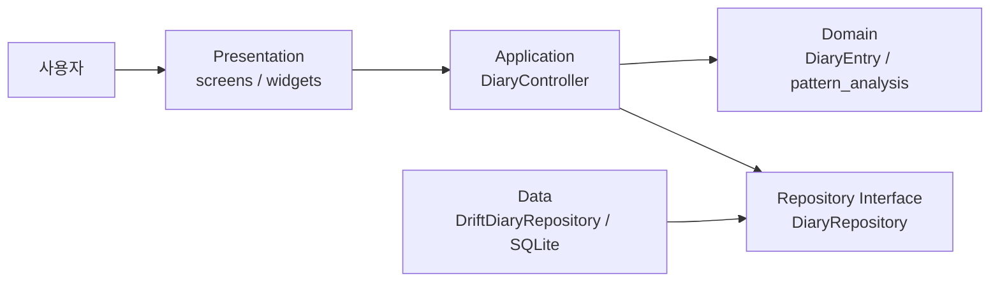
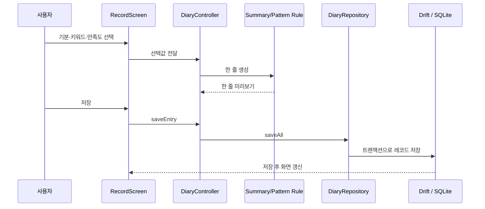

# 하루톡 아키텍처

## 목표

하루톡은 개인 프로젝트 규모에서 설명 가능성과 테스트 용이성을 확보하기 위해 Repository Pattern을 적용한 간소화된 Layered Architecture를 사용한다.



## 현재 디렉토리 구조

```text
lib/
  main.dart
  prototype/
    ai_diary_app.dart
    diary_controller.dart
    diary_entry.dart
    diary_repository.dart
    backup_file_service.dart
    database/
      harutalk_database.dart
    drift_diary_repository.dart
    migrating_diary_repository.dart
    shared_preferences_diary_repository.dart
    pattern_analysis.dart
    screens/
      record_screen.dart
      diary_screen.dart
      mood_grass_screen.dart
      my_screen.dart
      summary_editor.dart
    widgets/
      harutalk_ui.dart
      harutalk_theme.dart
      tori_chat_header.dart
      tori_mascot.dart
```

## 레이어별 책임

### Presentation

- `screens/`와 `widgets/`
- 사용자 입력을 받고 상태를 화면에 표시한다.
- 기록 규칙과 저장 형식은 직접 알지 않는다.

### Application

- `DiaryController`
- 기분·키워드·만족도 선택, 한 줄 생성, 저장·수정·삭제 흐름을 조정한다.
- `ChangeNotifier`로 화면 갱신을 알린다.

### Domain

- `DiaryEntry`: 날짜, 기분, 키워드, 만족도, 한 줄을 가진 핵심 모델
- `pattern_analysis.dart`: 키워드별 만족도와 대표 기분을 계산하는 순수 로직
- 핵심 규칙:
  - 하루 기록은 한 개만 유지
  - 표본이 부족한 생활 패턴은 단정하지 않음
  - 사용자가 선택하지 않은 사건은 한 줄에 만들지 않음

### Data

- `DiaryRepository`: 저장 기능의 인터페이스
- `DriftDiaryRepository`: Drift/SQLite를 사용하는 실제 로컬 DB 구현
- `MigratingDiaryRepository`: 기존 SharedPreferences 기록을 최초 한 번 Drift로 이전
- `SharedPreferencesDiaryRepository`: 이전 데이터 읽기를 위해 유지하는 구현
- `BackupFileService`: JSON 백업 파일을 저장하거나 사용자가 선택한 파일을 읽음
- Controller는 구체적인 저장 기술 대신 Repository 인터페이스에 의존한다.

## 데이터 흐름



## Repository를 사용한 이유

테스트에서는 브라우저 저장소를 직접 사용하지 않고 `MemoryDiaryRepository`를 주입한다. Drift 저장소 자체는 메모리 SQLite로 별도 검증한다. Repository 경계 덕분에 SharedPreferences에서 Drift로 교체할 때 Controller와 화면은 거의 바꾸지 않았다.

백업 복원과 전체 삭제는 `DiaryRepository.replaceAll`을 사용한다. Drift 구현은 기록과 사용자 키워드를 한 트랜잭션에서 교체하며, 파일 선택과 다운로드는 `BackupFileService`로 분리했다.

## 현재 구조와 향후 구조 구분

| 항목 | 현재 구현 | 향후 후보 |
|---|---|---|
| 상태 관리 | ChangeNotifier | 기능이 커지면 Riverpod 검토 |
| 로컬 저장 | Drift/SQLite | 여러 기기 동기화가 필요하면 서버 저장 검토 |
| 한 줄 생성 | 규칙 기반 | 로컬 AI 서버 연결 |
| 배포 | Flutter Web + GitHub Pages | Android APK |

현재 구현하지 않은 기술을 발표에서 구현했다고 말하지 않는다. 대신 개인 프로젝트 범위에서 왜 단순한 구조를 선택했는지 설명한다.

## 관련 ADR

- ADR-0001: Flutter 선택
- ADR-0002: Repository Pattern 기반 간소화 구조
- ADR-0003: Drift/SQLite 로컬 우선 저장
