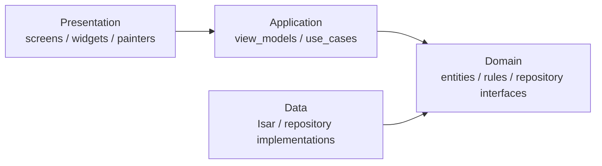
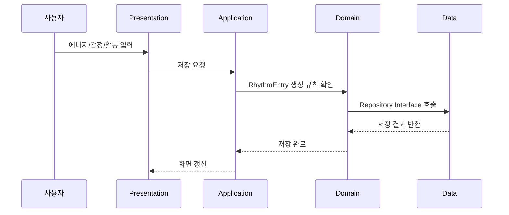

# Rhythm — Architecture

> Rhythm 데모 앱의 현재 구조와 최종 목표 아키텍처를 설명한다.

---

## 1. 아키텍처 목표

Rhythm은 감정, 에너지, 활동 기록을 기반으로 사용자의 하루를 Wave Graph로 표현하는 모바일 앱이다.  
앱의 핵심은 단순 UI가 아니라 **기록 데이터 → 감정/활동 해석 → 시각화**로 이어지는 흐름이다.

따라서 최종 구조는 `Presentation`, `Application`, `Domain`, `Data` 레이어를 나누는 Layered Architecture를 목표로 한다.

---

## 2. 현재 중간 발표 데모 구조

현재 데모는 발표 시연을 위해 Flutter Web에서 빠르게 실행되는 단일 앱 형태로 구현했다.

```text
lib/
  main.dart
test/
  widget_test.dart
docs/
  architecture.md
  setup.md
  presentation/
    interim.md
```

`lib/main.dart` 안에는 다음 역할이 포함되어 있다.

| 역할 | 현재 구현 |
|------|-----------|
| 앱 진입점 | `RhythmApp` |
| 화면 상태 | `RhythmHomePage` |
| 데이터 모델 | `RhythmEntry` |
| 입력 화면 | `_HomeTab` |
| 히스토리 화면 | `_HistoryTab` |
| 패턴 화면 | `_PatternTab` |
| 시각화 | `RhythmWavePainter`, `WeeklyRhythmPainter` |
| 데모 저장 | `shared_preferences` |

---

## 3. 목표 레이어 구조



### Presentation Layer

- 화면, 위젯, Wave Graph를 담당한다.
- 사용자의 입력을 받고 ViewModel에 전달한다.
- 예: 일일 입력 화면, 히스토리 화면, 패턴 화면

### Application Layer

- 화면 상태와 UseCase 호출 흐름을 관리한다.
- Riverpod Notifier/ViewModel을 둘 예정이다.
- 예: 오늘 기록 저장, 히스토리 불러오기, 패턴 계산 요청

### Domain Layer

- 앱의 핵심 규칙을 담당한다.
- UI나 DB에 의존하지 않는다.
- 예: `RhythmEntry`, 감정 색상 규칙, 에너지 계산 규칙, 감정-활동 상관 분석 규칙, Repository Interface

### Data Layer

- 실제 저장소 구현을 담당한다.
- 최종 구조에서는 Isar DB를 사용한다.
- 예: Isar Collection, Repository 구현체, 데이터 매핑, 선택 기능으로 저장되는 날씨 맥락 데이터

---

## 4. 데이터 흐름



현재 데모에서는 이 흐름을 하나의 파일 안에서 단순화해 구현했다. 이후 기능이 늘어나면 위 레이어 구조로 분리한다.

---

## 5. ADR 연결

| ADR | 결정 | 아키텍처 영향 |
|-----|------|---------------|
| ADR-0001 | Flutter 선택 | CustomPainter 기반 시각화와 Web/Windows 실행 가능 |
| ADR-0002 | Layered Architecture | UI, 로직, 저장소 책임 분리 |
| ADR-0003 | Isar 기반 로컬 우선 저장 | Data Layer를 로컬 DB 중심으로 설계 |

---

## 6. 다음 구조 개선 계획

- [ ] `RhythmEntry`를 `lib/domain/entities/`로 분리
- [ ] 저장 흐름을 `RhythmRepository` Interface로 분리
- [ ] 화면 상태를 Riverpod Notifier로 이동
- [ ] `shared_preferences` 데모 저장을 Isar 구현체로 교체
- [ ] Wave Painter를 `lib/presentation/widgets/`로 분리
- [ ] 감정-활동 상관 분석을 Domain Service로 분리
- [ ] 주간 리듬 리포트를 UseCase로 분리
- [ ] 날씨 API를 도입할 경우 Data Layer의 선택적 External Data Source로 분리

---

*문서 버전: 1.1*  
*작성일: 2026-05-26*  
*수정일: 2026-06-02*
