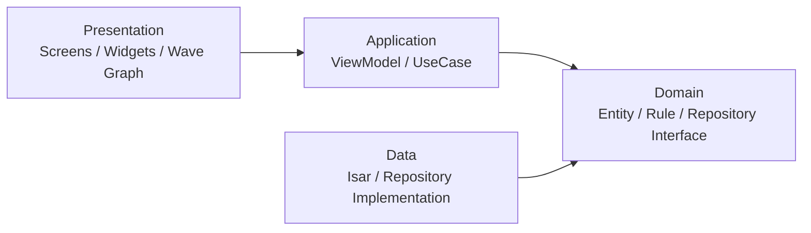

# Rhythm
## 감정의 파도를 시각화하는 다이어리 앱

윤세호  
중간 발표 · 2026-05-26

---

## 1. 문제 정의

기존 다이어리 앱은 기록이 길고 무겁거나, 쌓인 기록을 리스트와 숫자로만 보여주는 경우가 많다.

Rhythm은 매일 30초 안에 감정, 에너지, 활동을 기록하고 이를 Wave Graph로 표현해 사용자가 자신의 생활 리듬을 직관적으로 돌아보게 하는 앱이다.

> 한 줄 가치 제안:  
> **매일 30초, 감정을 톡톡 찍으면 내 감정의 파도가 보이는 다이어리 앱**

---

## 2. 사용자 시나리오

### 오늘의 리듬을 남기는 사용자

1. 밤에 앱을 열고 오늘의 에너지 레벨을 선택한다.
2. 감정 키워드 3개와 주요 활동 태그를 고른다.
3. 저장하면 오늘의 기록이 로컬 DB에 저장된다.
4. Wave Graph가 입력값을 색과 파동 그래프로 표현한다.
5. 이후 히스토리에서 날짜별 기록과 주간 패턴을 다시 확인한다.

**목표:** 입력부터 시각화 확인까지 1분 이내

---

## 3. Must 기능

| ID | 기능 | 중간 발표 기준 |
|----|------|----------------|
| M1 | 일일 리듬 입력 | 에너지, 감정, 활동 입력 흐름 설계 완료 |
| M2 | Wave Graph 일일 시각화 | CustomPainter 기반 데모 구현 |
| M3 | 히스토리 조회 | 날짜별 기록 조회 구조 설계 |
| M4 | 패턴 분석 | 평균, 빈도 기반 힌트로 범위 축소 |
| M5 | 오프라인 지원 | Isar 기반 로컬 우선 구조 결정 |
| M6 | 구조/상태관리 | Flutter + Riverpod + Layered Architecture 결정 |

---

## 4. 기술 스택과 선택 이유

| 영역 | 선택 | 이유 |
|------|------|------|
| 프레임워크 | Flutter | iOS/Android 단일 코드베이스, CustomPainter 활용 |
| 상태 관리 | Riverpod | ViewModel/상태 흐름을 명확히 분리 |
| 데이터 저장 | Isar | 오프라인 우선, 구조화된 로컬 기록 저장 |
| 아키텍처 | Layered + Domain 중심 | UI, 로직, 저장소 역할 분리 |

결정 근거는 ADR로 기록했다.

- `ADR-0001`: Flutter 선택
- `ADR-0002`: Layered Architecture
- `ADR-0003`: Isar 기반 로컬 우선 저장

---

## 5. 아키텍처 방향

핵심 원칙:  
**Wave Graph와 감정 파동 계산 로직을 분리한다.**

---

## 6. 현재 진행 상황

| 구분 | 상태 | 산출물 |
|------|------|--------|
| 기획 | 완료 | Vision, Requirements |
| 일정/범위 | 완료 | WBS, Schedule, Risk |
| 기술 결정 | 완료 | ADR 3개 |
| 시각 자료 | 완료 | WBS Gantt HTML |
| 앱 구조 | 진행 중 | Flutter Web 데모 프로젝트 |
| 구현 데모 | 진행 중 | 입력, Wave Graph, 히스토리, 패턴 카드 |

현재는 기획과 설계 산출물을 정리한 뒤, Flutter Web 기반 중간 발표용 데모를 구현했다.

---

## 7. 데모 / 시각 자료

  

    <h3>발표 산출물</h3>
    <ul>
      <li>GitHub 저장소의 기획 문서 세트</li>
      <li>WBS/Gantt 페이지</li>
      <li>ADR 3개</li>
      <li>Flutter Web 데모 앱</li>
    </ul>
    
https://yseho031018.github.io/rhythm-archive/wbs-gantt.html

  

  

    <h3>데모 시나리오</h3>
    <ol>
      <li>오늘 탭에서 에너지, 감정, 활동을 입력한다.</li>
      <li>저장 후 Wave Graph가 바뀌는지 확인한다.</li>
      <li>히스토리 탭에서 저장된 기록을 확인한다.</li>
      <li>패턴 탭에서 평균 에너지와 자주 나온 감정/활동을 확인한다.</li>
    </ol>
  

---

## 8. 남은 일정과 우선순위

| 주차 | 목표 | 우선순위 |
|------|------|----------|
| 12주차 | 중간 발표, 구조 확정 | 발표 피드백 반영 |
| 13주차 | 일일 기록 기능 | 입력 화면, 저장/조회 |
| 14주차 | 히스토리와 패턴 | 날짜별 조회, 통계 카드 |
| 15주차 | 테스트와 최종 발표 | README, 검증 기록, 데모 안정화 |

가장 중요한 우선순위는 **일일 기록 → 로컬 저장 → 기본 시각화** 순서다.

---

## 9. 현재 어려운 점

- Wave Graph는 앱의 차별점이지만 성능과 구현 난도가 있다.
- Flutter, Riverpod, Isar를 함께 쓰는 구조를 직접 설명할 수 있어야 한다.
- 7주 개인 프로젝트 범위에서 Should/Could 기능을 과하게 넣지 않아야 한다.

대응:

- Must 기능을 먼저 완성한다.
- AI Agent가 만든 코드는 직접 읽고 설명 가능한 범위만 반영한다.
- 발표 피드백을 기준으로 일정과 기능 범위를 다시 조정한다.

---

## 10. Q&A 준비

예상 질문:

1. 왜 Flutter를 선택했나요?
2. 왜 백엔드 없이 로컬 DB를 선택했나요?
3. Wave Graph 데이터는 어디서 오나요?
4. 현재 가장 큰 위험은 무엇인가요?
5. AI Agent는 어디까지 활용했나요?

답변 원칙:

> AI가 생성한 부분은 숨기지 않고,  
> 제가 검토하고 수정한 내용을 함께 설명하겠습니다.

---

## 질문 받겠습니다

감사합니다.
